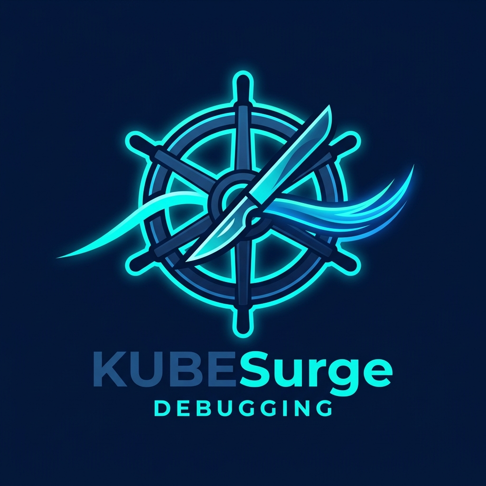

<div align="center">
  
  <h1>KubeSurge</h1>
  <p><strong>Surgical, zero-touch live diagnostic utility for hardened Kubernetes clusters.</strong></p>

  [](https://github.com/kubesurge/kubesurge/actions/workflows/release.yml)
  [](https://pkg.go.dev/github.com/kubesurge/kubesurge)
  [](https://github.com/kubesurge/kubesurge/releases)
  [](LICENSE)
</div>

KubeSurge injects lightweight ephemeral containers to run non-destructive debugging, trace processes, and stream network/heap captures directly to cloud storage buckets (AWS S3, GCP GCS, Azure Blob) or local paths over encrypted memory pipes, without writing sensitive data to node disks.

---

## Value Proposition

Hardened enterprise Kubernetes clusters present a difficult troubleshooting paradox:
1. **Distroless Images:** Container images are stripped down for security (no shell, no package manager, no troubleshooting utilities).
2. **Immutable Pods:** Modifying pod specifications to add debugging sidecars triggers a restart, destroying the active memory leak, socket exhaustion, or thread pool deadlock state you need to capture.
3. **Disk Compliance Violations:** Running utilities that write raw packet captures (`.pcap`) or managed heap dumps to local host directories (`/var/log` or `/tmp`) violates security and data compliance policies.

KubeSurge solves this by executing dynamic namespace injection to debug live applications:

* **Zero Disk Footprint:** Captures are streamed via the Kubernetes control plane using an in-memory pipe directly to your destination. No bytes touch the worker node's disk.
* **Bounded Buffer Safety:** Capture streams are wrapped in a rate-limiting memory buffer to prevent local memory exhaustion (OOM crashes) during high-throughput troubleshooting.
* **Custom Tooling:** Injects a minimal debug container (~90MB) populated with verified network tools and .NET diagnostics, avoiding massive, unverified third-party images.
* **Hardened Cluster Integration:** Automatically handles namespace policies (PSA, Kyverno) by dropping down to minimal capability sets (`CAP_NET_RAW` and `CAP_SYS_PTRACE`) or explicitly overriding non-root execution parameters (`RunAsUser: 0`) when requested.

---

## Prerequisites

To run KubeSurge, you need:
* **Kubernetes Cluster v1.25+** (with ephemeral containers enabled and stable).
* `kubectl` configured with access to the target cluster.
* **RBAC permissions** to PATCH `pods/ephemeralcontainers` and CREATE `pods/exec`.
* For cloud storage exfiltration: Active cloud provider credentials configured on your local machine (e.g. AWS IAM credentials, Google Application Default Credentials, or Azure Entra credentials).

---

## Installation

### Homebrew (macOS & Linux)
```bash
brew install kubesurge/tap/kubesurge
```

### Krew (Kubernetes Plugin Manager)
```bash
kubectl krew install kubesurge
```

### Direct Download
Download the pre-compiled binary matching your architecture from the [GitHub Releases Page](https://github.com/kubesurge/kubesurge/releases) and move it into your path.

---

## Quick Start

### 1. Verify Access (RBAC Preflight)
Confirm your context is authorized to perform ephemeral debugging:

```bash
kubesurge rbac-check -n default -p <target-pod>
```

### 2. Run a Live Network Capture
Capture traffic on a pod and stream it directly to a local file or cloud bucket:

```bash
# Capture to local disk (uses the signed ghcr.io/kubesurge/debugpod image)
kubesurge capture network -n default -p <target-pod> --duration 15s --sink ./capture.pcap --privileged

# Exfiltrate capture directly to an AWS S3 bucket
kubesurge capture network -n default -p <target-pod> --duration 30s --sink s3://my-bucket/ --privileged

# Exfiltrate capture directly to an Azure Blob container
kubesurge capture network -n default -p <target-pod> --duration 30s --sink azblob://my-container/ --privileged
```

---

## Developer Sandbox (Build from Source)

If you are running a local Kind cluster and want to compile or modify KubeSurge:

### 1. Build the CLI Binary
```bash
# Clone the repository
git clone https://github.com/kubesurge/kubesurge
cd kubesurge

# Compile
make build
# Install locally to /usr/local/bin
make install
```

### 2. Build & Load the Debug Container
To compile the custom diagnostic container and load it directly into your local Kind nodes:

```bash
make kind-load KIND_CLUSTER=idp-dev-cluster
```

Now run captures using the local dev image tag:
```bash
kubesurge capture network -n default -p <your-pod> --duration 10s --sink ./test.pcap --image ghcr.io/kubesurge/debugpod:latest --privileged
```

---

## Included Diagnostic Tools

Our custom harvested debugpod image (`ghcr.io/kubesurge/debugpod:latest`) is compiled in a multi-stage pipeline verifying all shared libraries. It contains:

### Network
* `tcpdump` — Raw packet sniffer (supports BPF filters: `--filter "port 8080"`)
* `ss` / `ip` — Socket connections and route tables inspection
* `curl` / `nc` — Connectivity testing and HTTP debugging
* `dig` / `nmap` — DNS resolution and port checking

### Processes & System
* `strace` — System call tracer (inspect active application thread syscalls)
* `ps` / `top` / `lsof` — Process and file descriptor tables

### .NET Application Tools
* `dotnet-dump` — Capture and analyze managed heap states (locate memory leaks)
* `dotnet-trace` — Collect CPU trace information to find execution hot paths
* `dotnet-counters` — Monitor garbage collector metrics, threadpool queues, and request rates in real time

---

## Security & Threat Model

* **Host Namespace Protection:** By default, KubeSurge prevents injection into pods that have host namespace access (`hostPID`, `hostNetwork`, or `hostIPC` enabled). Injecting an ephemeral container into a host-privileged pod can lead to host node compromise. To override this protection on authorized pods, pass the `--allow-host-namespaces` flag.
* **Namespace Isolation:** The `capture` command isolates the container namespaces (target container PID namespace is not shared by default unless process actions like `dotnet-dump` are run), reducing exposure of sensitive application container environment variables.
* **Control Plane Isolation:** Exec traffic flows entirely through the Kubernetes API server using the TLS-secured SPDY stream. Raw PCAP payloads or heap dumps are streamed into memory pipes on the client machine and are not written to the API server or node disk.
* **Image Digest Pinning:** To prevent registry image spoofing or tag mutation attacks in production, you can reference the debug image by its cryptographic hash instead of version tag:
  ```bash
  kubesurge capture network -n default -p my-pod --image ghcr.io/kubesurge/debugpod@sha256:xxxx...
  ```
* **No DaemonSets or Privileged Operators:** Unlike traditional agents, KubeSurge requires no persistent privileged daemonsets, maintaining a zero-footprint architecture when idle.

---

## Verification & Image Signing

To secure the container supply chain, every image pushed to `ghcr.io/kubesurge/debugpod` is signed using keyless signing via [Cosign](https://github.com/sigstore/cosign). 

The signature is backed by GitHub Actions OIDC identity, binding the build path to the official repository.

### Verify the Image Signature
You can verify the signature of a pulled tag using the following command:

```bash
cosign verify ghcr.io/kubesurge/debugpod:latest \
  --certificate-identity-regexp 'https://github.com/kubesurge/kubesurge/.github/workflows/release.yml@' \
  --certificate-oidc-issuer https://token.actions.githubusercontent.com
```

---

## Troubleshooting & FAQ

#### Q: The injection fails with `existing ephemeral containers may not be removed`.
**A:** Kubernetes ephemeral containers are **append-only**. Once injected, they remain in the pod spec until the pod is deleted. You cannot re-inject a container with the same name. KubeSurge generates unique names (e.g. `kubesurge-<timestamp>`) automatically. If you hit this error, verify that you are not manually specifying a duplicate container name.

#### Q: I get `socket: Operation not permitted` or `You don't have permission to perform this capture` during capture.
**A:** This happens when pod-level security contexts (such as `runAsNonRoot: true`) prevent the ephemeral container from running as root, stripping capabilities. Use the `--privileged` flag to explicitly override execution parameters and force UID 0.

#### Q: Does injecting an ephemeral container restart my application?
**A:** No. Ephemeral containers are attached dynamically to the running container namespaces via the kubelet. The application container runs uninterrupted.

---

## Scoped RBAC Template

To authorize KubeSurge to inject containers, apply the following ClusterRole:

```yaml
apiVersion: rbac.authorization.k8s.io/v1
kind: ClusterRole
metadata:
  name: kubesurge-troubleshooter
rules:
- apiGroups: [""]
  resources: ["pods"]
  verbs: ["get", "list", "watch"]
- apiGroups: [""]
  resources: ["pods/ephemeralcontainers"]
  verbs: ["get", "patch"]
- apiGroups: [""]
  resources: ["pods/exec"]
  verbs: ["create"]
```
